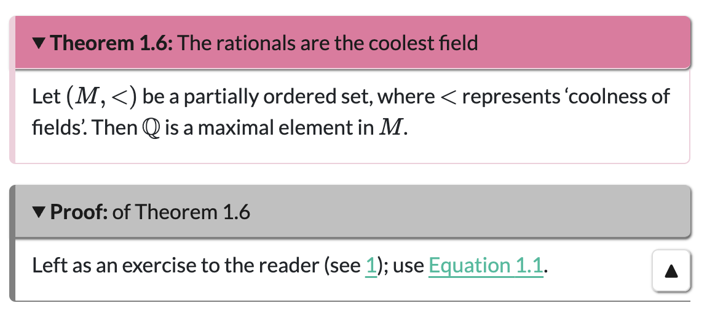

## Why Quarto?

Quarto is a powerful open-source typesetting language. Including both R and Python functionality, it can be used to write a huge range of outputs including full websites of html pages, interactive Python or R workbooks via Jupyter, dynamic and accessible slides, or even traditional lecture notes.

## Structure of the workshop {.smaller}
 
This hands-on interactive workshop will teach you how to create and build Quarto documents. The workshop will cover: 

- how to build Quarto documents (Part 1)
- writing content in Quarto (Part 2)
- working with revealjs slides (Part 3)
- authoring longer-form documents such as lecture notes (Part 4). 

Templates are provided, and can be found at <https://tdhc153.github.io/smsn-quarto-workshop/>, along with these slides (which you can read along with/copy code from during the session).

You can download the source code from <https://github.com/tdhc153/smsn-quarto-workshop>.

# Part 1: Let's build

## Let's get started

1. Open up your editor of choice. 

2. Download the Quarto template from [GitHub](https://github.com/tdhc153/smsn-quarto-workshop) either locally (R Studio) or onto your cloud (Posit Cloud)

3. If using R Studio or Posit Cloud, open up the .RProj file, and then open index.qmd inside the project. If not, open up index.qmd.

4. Click 'Render' above the source code (if using R Studio or Posit Cloud) or render in another way if using another editor. 

5. The html should appear on your preferred browser.

## Creating your own file

1. In the **same** R Studio session/same directory as index.qmd file, duplicate the index.qmd file and rename it to (filenameofyourchoice).qmd. 

2. Change the title and author at the top to an appopriate title and appropriate author.

3. Type 'Hello universe' underneath the bottom three dashes `---`.

4. Click 'Render' above the source code (if using R Studio or Posit Cloud) or render in another way if using another editor. 

5. The html should appear on your preferred browser.

# Question break/breather: has everyone rendered a file?

## Structure of a Quarto document (1/2)

In your file, there are two distinct parts: the **YAML header** and the **content**.

The YAML header, contained between three dashes `---`, is written in a language called YAML, and provides **local options** for the .qmd page (such as a title, author, preferred format, abstract, etc.)

Everything after that is the **content**, and can include almost anything you want, from **writing** to **code**. 

## Structure of a Quarto document (2/2) {.smaller}

There are a few main ways to provide flavour to your writing. Of note are 

- **spans** `[](){}` that provide in-line formatting
- **div blocks** `:::{.divname} ... :::` providing formatting to blocks of text
- **code blocks** to display code (three backticks, space)
- **code chunks**, which are blocks of executable code that Quarto runs during the rendering process, outputting a result (such as using R to provide a figure).
- **comments** `<!-- this is commented out -->` (in R Studio, highlight and Ctrl/Cmd + Shift + C)

:::{.callout-warning}

Code chunks are not in general executable on the html Quarto output; you will need to use a specialised format such as a Jupyter notebook to enable this functionality.

:::

## Structure of the YAML header or .yml file (1/2) {.smaller}

Here is the structure of the YAML header for this slidedeck:

```{.quarto}
---
title: "SMSN Quarto workshop"
subtitle: Accessible documents for all :)
author: Tom Coleman (University of St Andrews)
date: 2026-03-04
format: 
  revealjs:
    theme: default
---
```

You'll notice that `revealjs:` is indented by two spaces, and `theme:` is indented by two spaces after that. These are different option levels for `format:`, and option levels are always in multiples of two spaces.

## Structure of the YAML header or .yml file (2/2) {.smaller}

You can create lists of options by using multiple `-` at different option levels. For instance, changing `format: html` in your .qmd file to 

```{.quarto}
format:
  - html
  - docx
```

will build this file in both html and docx formats. Adding to the .yml file will build **all** documents in both html and docx formats. 

If you wanted to add options to both of these, you will need a slightly different format:

```{.quarto}
format:
  html:
    option1: true
    option2: false
  docx:
    option3: false
```

[A comprehensive list of options, commands, spans, everything, can be found at Quarto's excellent reference guide (click here)](https://quarto.org/docs/reference/)

## What happens when you render

Every time you click render on a .qmd file, Quarto 'knits' any code chunks by running the code, puts it into a Markdown (.md) file, then uses [Pandoc](https://pandoc.org/) to convert to the file format(s) specified in the YAML/.yml. These file formats include (but are not limited to):

- html (for websites, default output)
- pdf (via LaTeX, need a TeX distro or the R package `tinytex`)
- MS Word
- revealjs (html presentation format, like this)
- Jupyter notebooks (interactive Python/R notebooks)

[and many, many, many more](https://quarto.org/docs/output-formats/all-formats.html)

## Quarto project types

There are many types of Quarto project.

- [website](https://quarto.org/docs/websites/) (what this template is on)
- [book](https://quarto.org/docs/books/) (what the other template is written on, see Part 4)
- [manuscript](https://quarto.org/docs/manuscripts/) (for more formal scientific writing)
- [blog](https://quarto.org/docs/websites/website-blog.html) (for less formal scientific writing, amongst other things)

This workshop will be based on the website project class, with Part 4 using the book project class.

## Architecture of a Quarto website

Every buildable quarto website requires the following, which you can see in the directory

- **index.qmd** (root document)
- **(underscore)quarto.yml** (global settings)

You might have .qmd files for different parts of your quarto project; these are optional.

The template also comes with two more files in the directory:

- an **R Project file** (workspace image for R Studio)
- **presentation-blue.css** (make my slide deck look pretty :) )

## Building a document (1/2)

If you want to build a **single qmd file**, in or outside of a project environment, then clicking the 'Render' button as before will provide a preview of this page in your browser.

This is very useful for checking small changes to a single .qmd file as you go along, or preparing a single .qmd file for publication.

However, if you have multiple .qmd files in your project, this is not enough to put in all the necessary architecture when preparing a website for publication. 

## Building a website (2/2)

To prepare a full website for publication, you will need to run a **full render command**. To do this in R Studio, first:

- **save all of your documents**

then click 'Build' and then 'Render Website', or enter the following command in the console:

- `quarto::quarto_render()`

What this does is build every .qmd file in the directory, and puts it in the _site folder. This is then a fully working website, with all interconnected links working, ready for publication.

## Tips for building

:::{.callout-tip}

- To omit a file from a global build, put an underscore _ in front of the file name. This machinery is used by Quarto to avoid building the global .yml file and any files in _site. 

- To omit a single file from the finished product, include `draft: true` in the YAML header. This will still build the file, but any links to it will not be created in the final product and it will not exist on any listings.

- [An example of a complex website architecture using Quarto can be found by clicking this sentence.](https://github.com/tdhc153/starmast) 

:::

## Standalone Quarto documents {.smaller}

This may seem like too much... and it is. You are able to build standalone quarto documents with a single .qmd file.

However, I often find it more sensible to have one directory/R Project per thing: 

- keeps all working on the thing together
- easier to handle multiple .qmd files at once (questions.qmd, answers.qmd, for instance)
- better architecture for multiple outputs by using global settings
- **publishing the project to a GitHub repo allows you to use GitHub Pages to host your material online, with a public URL.**

# Question break/breather: are there any questions?

# Part 2: Let's write

## How to write

Quarto is based on the Markdown language, and as such, uses Markdown syntax. If you are familiar with how to write Markdown, then what follows might already be second nature to you.

If you are not familiar with Markdown, then here is how to write stuff in Quarto.

I will try and indicate which formats are used and where.

## Text formatting (all formats) {.smaller}

Quarto supports lots of different ways to format text:

| style | syntax | example |
|:------|:-----------|:----------------|
| bold | `**text**` | **a bold move** |
| italics | `*text*` | *the Italic Version* |
| both | `***text***` | ***a bold Italic move*** |
| strikethrough | `~~text~~` | ~~struck out~~ |
| super/subscript | `te^xt^, te~xt~` | super^script^, sub~script~ |
| underline | `[text]{.underline}` | [I hate underlining.]{.underline} |
| small caps | `[text]{.smallcaps}` | [I also hate smallcaps.]{.smallcaps} |
| highlighted | `[text]{.mark}` | [I don't mind highlighting.]{.mark} |

## Headings (html, pdf, word) {.smaller}

There are six levels of headings in Quarto, and you can reach any of these by using an appropriate amount of `#` keys before the heading title. 
```{.quarto}
# Chapter style heading
## Section style heading
### Subsection style heading
```
and so on.

:::{.callout-tip}

To make an unnumbered section (pdf, word), add `{-}` or `{.nonumber}` after the heading title.

:::

:::{.callout-note}

Headings work differently in revealjs or other presentation formats; see Part 3 for more.

:::

## Hyperlinks (all) {.smaller}

You can hyperlink to other pages in your website project:

- link to page: `[slides template](slidestemplate.qmd)` gives [slides template](slidestemplate.qmd)

There are two ways to include hyperlinks to external sites:

- plain: `<https://github.com/>` gives <https://github.com/>.

- regular: `[click here find more on hyperlinks](https://quarto.org/docs/authoring/markdown-basics.html#links-images)` gives [click here to go to GitHub](https://quarto.org/docs/authoring/markdown-basics.html#links-images).

:::{.callout-tip}

You can use standard file path syntax to hyperlink things in different folders. For example `[link](./1/2.qmd)` links to the file `2.qmd` in the subfolder `1`, and `[link](../3.qmd)` links to the file `3.qmd` in the parent folder of the qmd file you are working on.

:::

## Lists (all, 1/2) {.smaller #sec-lists}

::::{.columns}

::: {.column width="30%"}

In this example of a list, the dash `-` is used, but you can also use `+` or `*`. (Note: other mathematical operators are as yet untested.)

The spacing here between sublists is important and come in multiples of 2 for unordered lists and 4 for ordered lists. 

[Notice the brackets in the ordered lists - they do nothing.](./figures/thebracketsdonothing.png)

:::

::: {.column width="5%"}

 

:::

::: {.column width="25%"}

```{.quarto}
- first unordered
- second unordered
  - first subitem
    - first subsubitem
  - second subitem
- third item 
```

 
 
 


```{.quarto}
1. ordered item
    a) ordered subitem
    b) ordered subitem
        i. subsubitem
2. second ordered item
```

:::

::: {.column width="40%"}

::: {}

- first unordered 
- second unordered
  - first subitem
    - first subsubitem
  - second subitem
- third item 

:::

::: {}

1. ordered item
    a) ordered subitem
    b) ordered subitem
        i. subsubitem
2. second ordered item

:::

:::

::::

## Lists (all, 2/2) {.smaller}

::::{.columns}

::: {.column width="30%"}

Quarto is slightly fiddly when it comes to list continuations. See across.

Any list in Quarto requires an entire blank line before the list starts.

[Click here to find more on lists.](https://quarto.org/docs/authoring/markdown-basics.html#links-images)

:::

::: {.column width="5%"}

 

:::

::: {.column width="25%"}

```{.quarto}
- first unordered 

    continue
    
- second unordered
```

 
 
 
 
 

```{.quarto}
(@) List item 1!

Too enthusiastic. 

(@) List item 2.
```

:::

::: {.column width="40%"}

::: {}

- first unordered item

    continue 
    
- second unordered item

:::

 

::: {}

(@) List item 1!

Too enthusiastic. 

(@) List item 2.

:::

:::

::::

## Tables {.smaller}

```{.quarto}
| Right | Left    | Default  | Center      |
|------:|:--------|----------|:-----------:|
| Tom   | takes   | great    |  happiness  |
| in    | writing | Markdown |  tables     |

: Tom's table time {tbl-colwidths="[20,25,25,30]"}
```

 

| Right | Left    | Default  | Center      |
|------:|:--------|----------|:-----------:|
| Tom   | takes   | great    |  happiness  |
| in    | writing | Markdown |  tables     |

: Tom's table time {tbl-colwidths="[20,25,25,30]"}

 

[Quarto can also import tables from csv files and parse html table syntax. For more on this and tables in general, click here.](https://quarto.org/docs/authoring/tables.html)

## Images and figures (all, 1/2) {.smaller}

::::{.columns}

::: {.column width="40%"}

```
{width="75%" fig-alt="A picture of a beautiful tabby cat sitting in front of a laptop on a carpet, with sunlight streaming in through bay windows." fig-align="left"}
```

The syntax here implies that captioning is mandatory for images; you can leave it blank if needed. What you should definitely have is alt-text, which is provided by the fig-alt; it appears in the html output for access by screen readers.

:::

::: {.column width="5%"}

 

:::

::: {.column width="50%"}

{width="75%" fig-alt="A picture of a beautiful tabby cat sitting in front of a laptop on a carpet, with sunlight streaming in through bay windows." fig-align="left"}

:::

::::

## Images and figures (all, 2/2) {.smaller}

::::{.columns}

::: {.column width="40%"}

```
{width="75%" fig-alt="A picture of the same beautiful tabby cat, sitting in front of a window." fig-align="right" #fig-mimiagain}
```

Nothing else here to say, just wanted to show more pictures of cats.

Actually, that's a lie; I've identified this as a figure for cross-referencing purposes later in the talk.

[Oh, and click here if you want to learn more about figures.](https://quarto.org/docs/authoring/figures.html)

:::

::: {.column width="5%"}

 

:::

::: {.column width="50%"}

{width="75%" fig-alt="A picture of the same beautiful tabby cat, sitting in front of a window." fig-align="right" #fig-mimiagain}

:::

::::

## Videos (html for sure, definitely not pdf, word??)

::::{.columns}

::: {.column width="60%"}

Here's how to video.

```
(two open braces)< video ./figures/mimivideo.mp4 width="270" height="480" title="Mimi is petted.">(two close braces)
```

This is a video included as a local file, but you can use YouTube links as well to embed videos in your document. 

[Oh, and click here if you want to learn more about videos.](https://quarto.org/docs/authoring/figures.html)

:::

::: {.column width="5%"}

 

:::

::: {.column width="30%"}



:::

::::


## Maths (all) {.smaller}

All maths syntax is provided by LaTeX commands, with accessibility support provided by MathJax.

Inline maths is represented by single dollars: for instance `$\{n > 0\; : \; n\in\mathbb{N}$` provides $\{n > 0\; : \; n\in\mathbb{Z}\}$.

Display maths is represented by double dollars: for instance 
```{.quarto}
$$(x+y)^n = \sum_{k=0}^n\binom{n}{k}x^{n-k}y^k.$$
```
gives 
$$(x+y)^n = \sum_{k=0}^n\binom{n}{k}x^{n-k}y^k.$$

:::{.callout-tip}

Output of maths in MS Word is given by their native editor. It does not really recognise custom commands, but these can be used in other formats.

To produce an array of equations outputtable in all formats, use `$$\begin{aligned}...\end{aligned}$$` and treat this as an `eqnarray` environment.

:::

## Code blocks (html)

You can display blocks of code, using the following syntax:

```{.quarto}
(three ticks){.python}
import math
def binomial_coefficient(n, k):
    return math.comb(n, k)
binomial_coefficient(10,6)
(three ticks)
```

to get

```{.python}
import math
def binomial_coefficient(n, k):
    return math.comb(n, k)
binomial_coefficient(10,6)
```

Pandoc supports highlighting for 140 languages. [For more about code blocks, particularly in html, you can see this link here.](https://quarto.org/docs/output-formats/html-code.html)

## Code chunks (html) {.smaller}

You can include snippets of code to be run by Quarto as it builds your document, using the following syntax:

::::{.columns}

::: {.column width="40%"}

```{.quarto}
(three ticks){r}
#| echo: true
binom_coeff <- function(n, k) {
  if (k < 0 || k > n) return(0)
  choose(n, k)
}
binom_coeff(10, 6)
(three ticks)
```

:::

::: {.column width="10%"}

to get

:::

::: {.column width="40%"}

```{r}
#| echo: true
binom_coeff <- function(n, k) {
  if (k < 0 || k > n) return(0)
  choose(n, k)
}
binom_coeff(10, 6)
```

:::

::::

 

which is what you'd expect as $\displaystyle \binom{10}{6}$ is 210.

:::{.callout-tip}

Add options to executable code chunks by `#| option: value` directly below the three ticks and `{r}` For instance, you can stop Quarto from displaying the code above by amending to `#| echo: false`.

:::

## Embedding stuff (all, depending) {.smaller}

::::{.columns}

:::{.column width="45%"}

You can embed raw content into your Quarto file. For instance: 

```{.quarto}
(three ticks){=html}
embeddable content
(three ticks)
```

In addition, you can embed output content from another Quarto workbook (such as a Jupyter notebook) into a html file for ease of use. [Please click this link to find more.](https://quarto.org/docs/authoring/notebook-embed.html)

:::

::: {.column width="5%"}

 

:::

:::{.column width="50%"}

```{=html}
<iframe src="https://www.desmos.com/calculator/hj1dhkso2g?embed" width="500" height="500" style="border: 1px solid #ccc" frameborder=0></iframe>
```

:::

::::

## Cross-references (all)

Internal cross-references can be put into figures, tables, section headings. 

To do this, you need a **label** and a **reference** somewhere in the text.

Labels always have the following form `#identifier-string` where 'identifier' is a preset identifier prefix and 'string' is a string of text. Identifier prefixes include `fig` (figure), `tbl` (table), `eq` (equation), `sec` (section), `lst` (code block);

To reference a label in the text, write `@identifier-string`. This creates a reference, like @fig-mimiagain. [Click this link to find out more about cross-referencing](https://quarto.org/docs/authoring/cross-references.html).

## Callout blocks (most) {.smaller}

Here's a callout block; divs that draw attention to things. 

```
:::{.callout-note}
There are five types of callout block; note (identifier prefix `not`), warning (identifier prefix `war`), important (identifier prefix `imp`), caution (identifier prefix `cau`), tip (identifier prefix `tip`). Replace 'note' in `callout-note` above to get your desired box.
:::
```

:::{.callout-note}
There are five types of callout block; note (identifier prefix `not`), warning (identifier prefix `war`), important (identifier prefix `imp`), caution (identifier prefix `cau`), tip (identifier prefix `tip`). Replace 'note' in `callout-note` above to get your desired box.
:::

Callout boxes also exist for mathematical environments, but these do not count sequentially. (See Part 4.) 

[Click here to find out about callout boxes.](https://quarto.org/docs/authoring/callouts.html)

## Conditional content (all)

You might want to have an interactive html version of a document coupled to a printable pdf version, where interactivity between the two could display very differently. You could use **conditional content** to facilitate this. 

```{.quarto}
::: {.content-visible when-format="html"}

Will only appear in html.

:::
```
You can change `visible` to `hidden`, and `when` to `unless`, and `html` to `genericoutput` to fully facilitate all possible options. 

# Question break/breather: are there any questions?

# Part 3: Let's present

## Formatting

To create a presentation file, here's what to do:

1. Open up index.qmd and duplicate this file in the same directory. Give it a snappy name like (myfirstpresentation.qmd).

2. Change the title, author to appropriate things.

3. Next, change `format: html` to `format: revealjs`

4. Delete everything under the bottom three dashes `---`.

5. Click render, or build in whatever way seems comfortable.

6. The html should appear in your browser, and it should be a title slide.

## Why revealjs?

- This is a native html presentation, which means it is accessible as standard.

- Translate all of your beautiful Quarto code to presentation format, including use of LaTeX maths, R/Python code blocks and chunks, embeddable videos etc. 

    In fact, almost all of the content in Part 2 can be applied here as well.

- The html scales to the size of your browser window, making it excellent for use on all sizes of screen. 

- ~~Not proprietary.~~ ~~Not made by Microsoft.~~ Free to use and share!

## Adding slides to the document {.smaller}

To add slides to the document, you use headings. Two hashes `##` give you a new slide. One hash `#` gives you a way to split slides into bits. Further hashes `###` give slide subtitles. A triple dash `---` creates a slide without a title.

```{.quarto}
## Initial slide

slide content

# This is a whole title slide used to demark parts of a presentation

## Next slide

### Subtitle

#### Extra subtitle

more slide content

---

no title on slide

```

## Making slides fit {.smaller}

Sometimes, your content won't fit on the slides. There are two ways to deal with this. One, you can make your text smaller; two, you can make the slide scrollable.

To do this, add `.{.smaller}` or `{.scrollable}` directly after the slide title:

```{.quarto}
## Tiny text slide {.smaller}

this text is smaller

## Scrollable slide {.scrollable}

[text omitted]
```

:::{.callout-tip}

You can also apply these settings at document level, by replacing `format: revealjs` in the YAML header with:

```{.quarto}
format:
  revealjs:
    scrollable: true
    center-title-slide: false
```

:::


## Columns {.smaller}

To split slides into columns, you can do the following with nested divs:

```{.quarto}
::::{.columns}

:::{.column width="45%"}

content on left

:::

:::{.column width="50%"}

content on right

:::

::::

```

::::{.columns}

:::{.column width="45%"}

content on left

:::

:::{.column width="50%"}

content on right

:::

::::

:::{.callout-tip}
If spacing is an issue, consider adding the following column to the middle:
```{.quarto}
::: {.column width="5%"}
 
:::
``` 
The character ` ` (obtained by (option)+Space on a Mac) is a non-breaking space.

:::

## Presenting: pauses and increments (1/2) {.smaller}

To pause between two blocks of text, use `. . .` between paragraphs

. . . 

like this.

. . .

You can reveal lists incrementally by the following.

```{.quarto}
:::{.incremental}
1. This appears first.
2. Then, this appears.
3. A surprise.
:::
```

:::{.incremental}
1. This appears first.
2. Then, this appears.
3. ***Boo!***
:::

. . . 

You can add a logo and footer text to your slides by using options `logo: filepathtologo.png` and `footer: footer text` in the YAML header.

## Presenting: asides, footnotes, speaker notes (2/2) {.smaller}

Here's how to put a footnote in^[See?]: `text^[footnote text]`. And here's how to do an aside:

```{.quarto}
:::{.aside}
Footnotes and asides also work in standard html documents.
:::
```

:::{.aside}
Footnotes and asides also work in standard html documents.
:::

You can add speaker notes to your presentation by adding the following div to the very bottom of a slide:

```{.quarto}
:::{.notes}
Tell everyone they look nice today. Don't forget to hydrate!
:::
```

To access speaker notes, press S when the revealjs file is open in your browser.

:::{.notes}
Tell everyone they look nice today. Don't forget to hydrate!
:::

## Themes {.smaller}

There are 12 different 'bootstrap' themes available for use. These are:

::::{.columns}

:::{.column width="50%"}

- `beige`
- `blood`
- `dark`
- `default`
- `dracula`
- `league`

:::

:::{.column width="50%"}

- `moon`
- `night`
- `serif`
- `simple`
- `sky`
- `solarized`

:::

::::

You can change these in the YAML header. [You can also modify your slide backgrounds slide by slide as well; click this sentence to find out more.](https://quarto.org/docs/presentations/revealjs/#slide-backgrounds)

Alternatively, you can modify a CSS document as I have done, but:

:::{.callout-warning}
CSS files are a black hole for your time.
:::

# Question break/breather: are there any questions?

# Part 4: Let's write more

## The Quarto book project class

If, like me, you have cause to regularly output long-form mathematical writing to different outputs (html and pdf), then the `book` project class may be more appropriate for you. 

The `book` project class is a special kind of website that bestow numbers on chapters, allowing you to cross-reference between chapters. And...er...that's it.

If you are a LaTeX user, you can think of this as the difference between document classes `article` and `report`.

This section outlines some more advanced Quarto writing techniques in the `book` document class.

## Why: proper counting (1/2) {.smaller}

Part of the appeal of the `book` project class for me is the ability to count theorem environments sequentially overall, rather than by environment. So instead of having 

```
Definition 1.1
Theorem 1.1
Proof
Corollary 1.1
Definition 1.2
```

you will have 

```
Definition 1.1
Theorem 1.2
Proof
Corollary 1.3
Definition 1.4
```

(objectively better). This is achieved through the use of a **Quarto extension**, a piece of code that extends Quarto's capabilities to more specialised uses (if that is possible...)

## Why: custom maths commands (2/2)

The other thing that works well in the `book` project class is the idea of custom commands for typesetting mathematics. While you can do this locally in Quarto on every html page, this can be a little bit of a faff. By using conditional content (see Part 2), you're able to put your custom commands into only two files and include them.

## The inputs {.smaller}

All chapters are included as separate .qmd files. These will only be built with a `quarto::quarto_render()` command if you tell it to. For this reason, the `_quarto.yml` file is super important. Here's an excerpt from the _quarto.yml class in the book template:

```{.quarto filename="_quarto.yml"}
book:
  title: "Quarto book template"
  author: "Tom Coleman"
  chapters:
    - index.qmd
    - part: "Content"
      chapters:
        - chapter1.qmd
        - chapter2.qmd
    - part: "Exercises"
      chapters:
        - questions.qmd
        - solutions.qmd
  appendices:
    - deflist.qmd
  # downloads:
  #   - pdf
```

This is a list of everything you want built by `quarto::quarto_render()`.

## pdf output

You may notice that there were two lines that were commented out of the previous code block.

These govern pdf output, and by opening up the .yml file (in QuartoBookTemplate) and uncommenting all of the commented lines in there, you can create a simultaneous pdf output for your document. 

:::{.callout-warning}
You may be prompted to install more packages to do this; please do so if you want a pdf output.
:::

There are some options there to play with as well :)

## What else?

- You can customise your section depth using `number-depth: number` as a `format` option; this will give you control of numbering sections (depth 1), sections and subsections (depth 2) and so on.

- You are able to create a bibliography by including a `{.refs}` div at the bottom of the document.

- You are able to create an index in a pdf output by using the `makeidx` TeX engine.

[Please click this link for more about book structure.](https://quarto.org/docs/books/book-structure.html)

## Maths environments in the book template (1/3) {.smaller}

There is a folder called `_extensions` in the QuartoBookTemplate repo which contains the extension called `custom-numbered-blocks`. To tell a .yml file to use a particular extension, you need to call it as a filter:

```{.quarto filename="_quarto.yml"}
project:
  type: book
  
filters:
  - custom-numbered-blocks
```

Then, there are options further down the .yml file which has configured this extension to handle all sorts of different maths environments. These are:

```
Theorem, Corollary, Proposition, Lemma, Algorithm, Question, Observation, Conjecture, Definition, Remark, Aside, Example, Feature, Proof, Solution, Claim, Notation, Convention
```
and you can add more if needed!

## Maths environments in the book template (2/3)

Here's an example, with output given in @fig-output.

```{.quarto}
:::{.Theorem #theoremrationals}

## The rationals are the coolest field

Let $(M,<)$ be a partially ordered set, where $<$ represents
'coolness of fields'. Then $\mathbb{Q}$ is a maximal element 
in $M$.

:::

:::{.Proof .unnumbered}

## of Theorem \ref{theoremrationals}

Left as an exercise to the reader (see \ref{Q1}); use @eq-rationals.

:::

```

---

The output looks like this:

{fig-alt="A picture of the Quarto output of the theorem." fig-align="center" #fig-output}

You can collapse any of these environments.

## Maths environments in the book template (3/3) {.smaller}

```{.quarto}
:::{.Theorem #theoremrationals}
## The rationals are the coolest field
[theorem text]
:::
:::{.Proof .unnumbered}
## of Theorem \ref{theoremrationals}
Left as an exercise to the reader (see \ref{Q1}); use @eq-rationals.
:::
```

- The `#` term in the braces is a reference label; unlike the inbuilt Quarto referencing system, references to these environments are called with `\ref{theoremrationals}`. All other references are done with `@eq-thing` as Quarto standard.

- The `##` term inside the div gives the theorem a title. 

- All environments are numbered by default; to unnumber them, include an `.unnumbered` in the braces.

- Theorems and definitions are added to a listing .qmd that you can include in the appendices.

## Custom commands

To make sure custom commands are usable, you can put all of your macros in **both** the `_preamble.qmd` file **and** (if using pdf output) the `preamble.tex`. The way that this works on every page is the inclusion of the following on line 1 of **each** qmd file:

```{.quarto}
(two open braces)< include _preamble.qmd >(two closed braces)
```

This will then put all of your macros in both the html and pdf output. In addition, you can customise your LaTeX output by adding as many packages as you want.

# That's all folks!

## Let me know what you think {.smaller}

::::{.columns}

::: {.column width="40%"}

I would be very grateful if you took the time to fill in a Google form about today's workshop, in order to improve the workshop for potential future runnings and to help me understand the impact of today's workshop. All submissions are entirely anonymous.

:::

::: {.column width="5%"}

 

:::

::: {.column width="50%"}

{width="75%" fig-align="center"}

:::

::::

Any other questions, comments, thoughts, please let me know at tdhc (at) st (dash) andrews (dot) ac (dot) uk. 

Thank you so much for coming, and Happy Quartoing! (Quarting? Quartoisation?)
